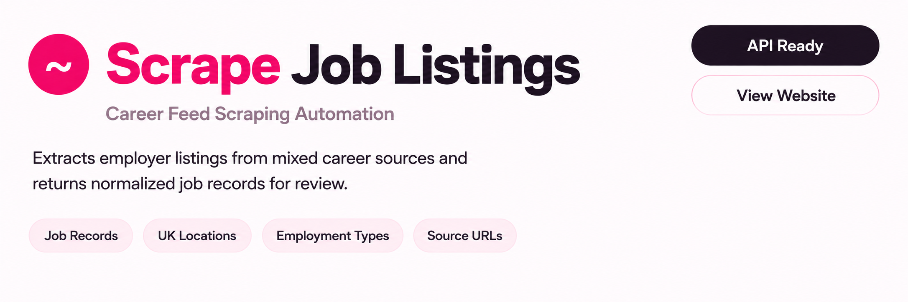
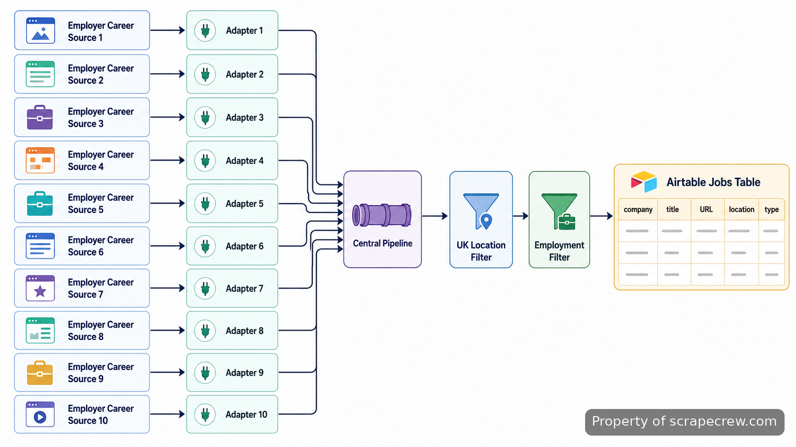
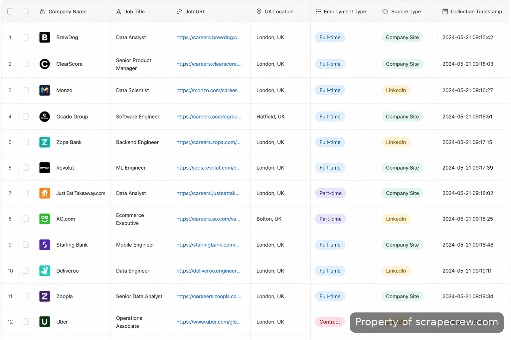
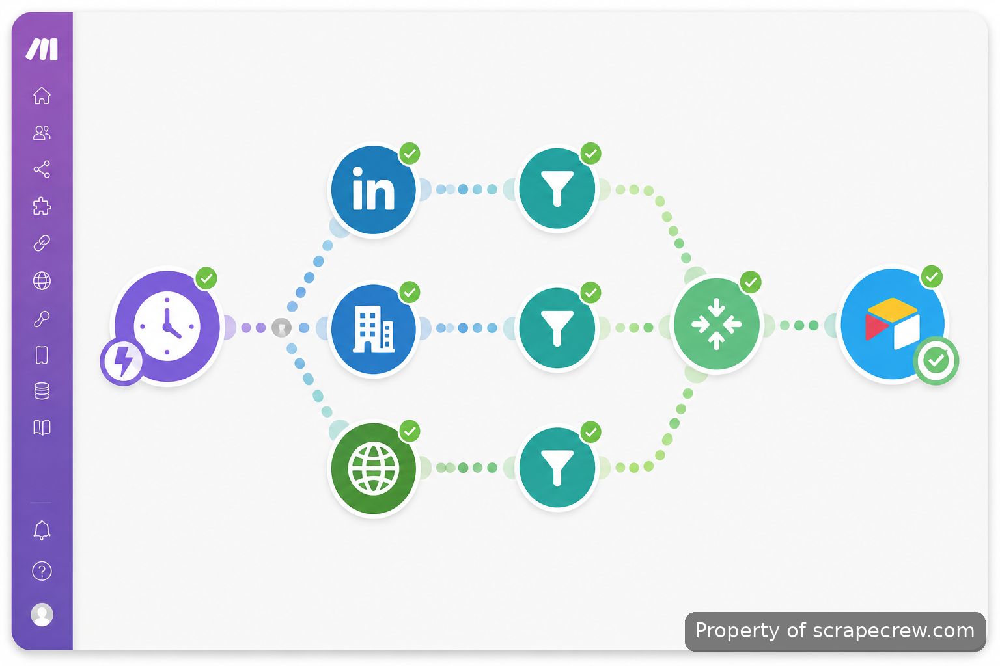
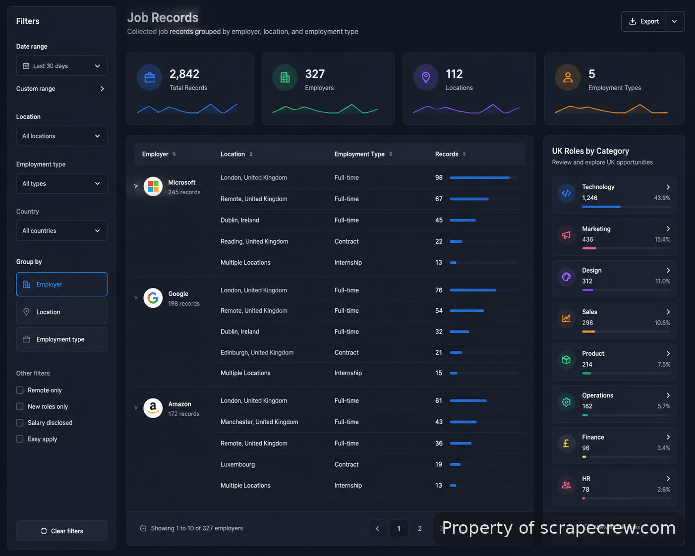

<p align="center">
  <a href="https://www.scrapecrew.com/scraper/scrape-job-listings-career-feed-automation" target="_blank">
    
  </a>
</p>

<p align="center">
  <a href="https://t.me/Bitbash333" target="_blank">
    
  </a>&nbsp;
  <a href="https://wa.me/923249868488?text=Hi%2C%20I%27m%20interested%20in%20ScrapeCrew." target="_blank">
    
  </a>&nbsp;
  <a href="mailto:hello@scrapecrew.com" target="_blank">
    
  </a>&nbsp;
  <a href="https://www.scrapecrew.com" target="_blank">
    
  </a>
</p>

## ScrapeCrew's Scrape Job Listings

ScrapeCrew's Scrape Job Listings is a no-code collection workflow for turning mixed UK employer career feeds into consistent Airtable records. The system checks configured sources, keeps only relevant openings, and preserves source details for review and maintenance.



The problem is that career pages rarely expose the same structure. One employer may provide JSON, another an ATS endpoint, and another only HTML. The workflow keeps those differences isolated instead of forcing every source through one parser. It uses Make.com's HTTP modules and Airtable's API to coordinate collection, filtering, and storage. Documentation for the automation platform is available through [Make HTTP app documentation](https://www.make.com/en/help/apps/http), while Airtable API behavior is covered in the [Airtable Web API documentation](https://airtable.com/developers/web/api/introduction).

## Career feed extraction across mixed sources

A single parser becomes fragile when employers change career systems. This build assigns each company its own adapter so JSON endpoints, RSS feeds, ATS feeds, and HTML pages can be handled independently.

| Feature | Description |
| --- | --- |
| Per-company source adapters | Different career stacks create inconsistent fields and markup. Each employer route uses its own extraction rules so one source change does not break the remaining feeds. |
| ATS-aware intake | Hidden structured data should not be reconstructed from rendered pages. The workflow can consume available Greenhouse Job Board API, Lever Postings API, Workday, or SmartRecruiters endpoints when exposed by the source. |
| UK location filtering | Global career pages create irrelevant records. Location text is normalized and checked for UK cities, regions, country names, and remote-UK signals before storage. |
| Employment type mapping | Source labels vary between permanent, graduate, intern, and full-time wording. Mapping rules reduce accepted records to Full-time or Internship classifications. |
| Sponsorship phrase filtering | Applicants can waste time on roles that explicitly reject sponsorship. Title and description text are checked for configured negative phrases before Airtable writes. |
| Duplicate-safe Airtable updates | Repeated runs can create duplicate openings without a stable key. The workflow checks a normalized company and job URL combination before creating or updating a record. |



## Automation stack and data handling

The workflow is built around visible route-by-route troubleshooting rather than a separate crawler service. Make.com schedules requests, branches by employer, applies rules, and controls Airtable writes. HTTP, RSS, and JSON modules cover structured sources, while HTML parsing rules handle sources without exposed feeds.

ATS sources are handled according to the APIs they expose. Relevant references include the [Greenhouse Job Board API documentation](https://developers.greenhouse.io/job-board.html), [Lever Postings API documentation](https://hire.lever.co/developer/documentation), and [SmartRecruiters API documentation](https://dev.smartrecruiters.com/customer-api/job-advert-api/). Workday integrations depend on the specific employer endpoint configuration.

```json
{
  "company_name": "Example Ltd",
  "job_title": "Data Analyst Intern",
  "job_url": "https://careers.example.com/jobs/123",
  "location": "London, UK",
  "employment_type": "Internship",
  "sourcetype": "atsjson",
  "collected_at": "2026-08-08T08:00:00Z"
}
```

## Implementation layout

```text
scrape-job-listings/
├── make-scenarios/
│   ├── career-feed-router.json
│   └── airtable-upsert.json
├── adapters/
│   ├── greenhouse.js
│   ├── lever.js
│   └── html-parser.js
├── schemas/
│   └── jobs-record.json
└── README.md
```

## How to Extract Listings Using ScrapeCrew's Scrape Job Listings

- **STEP 1 — Download & Set Up the Project** Download [ScrapeCrew's Scrape Job Listings](https://www.scrapecrew.com/scraper/scrape-job-listings-career-feed-automation) to access the completed workflow and configuration.
- **STEP 2 — Open the Scenario** Open the Make.com scenario and review employer routes, source adapters, and Airtable connection settings.
- **STEP 3 — Configure Sources** Select employer routes, adjust UK location rules, employment mappings, and sponsorship phrase filters for the required collection.
- **STEP 4 — Run Collection** Trigger the scenario run and receive normalized Airtable records with source metadata and timestamps.



## Use Cases

- Create a UK graduate vacancy table from a known employer list, with internship and full-time roles separated before review.
- Compare openings across employers using different ATS platforms without manually checking each career site.
- Remove clearly unavailable sponsorship roles before researchers review applications, while leaving ambiguous listings untouched.
- Expand employer coverage by adding new source adapters while keeping the same Airtable record structure.



## Operational checks and maintenance

The pilot runs every 6 hours, while Run once is available when verifying a new employer adapter. Acceptance checks cover 10 configured employer routes, required record fields, duplicate handling, and filtering order before records are written.

The workflow keeps collection rules separate from source-specific parsing. When employer pages change, maintenance can focus on the affected adapter instead of rebuilding the entire process. ScrapeCrew also supports [custom scraper maintenance](https://www.scrapecrew.com) and deployment work when additional sources or integrations are required.

## FAQ

### How does the workflow handle different employer career site formats?

Each employer uses a dedicated source adapter based on the available format, such as JSON endpoints, ATS feeds, RSS feeds, or HTML pages. This keeps extraction rules isolated when one career site changes its structure.

### Can the scraper remove roles that do not offer sponsorship?

Yes. The workflow checks job titles and descriptions for configured phrases that explicitly indicate sponsorship is unavailable. It does not infer eligibility from employer names or remove roles without a clear text signal.

### Where are collected job records stored after each run?

Records are written to an Airtable jobs table with company name, title, URL, location, employment type, source type, and collection timestamp. A normalized company and URL key prevents duplicate records during later runs.

<table>
  <tr>
    <td align="center" width="33%">
      
      <p>This scraper helped me gather thousands of posts effortlessly. The setup was fast, and exports are super clean and well-structured.</p>
      <p><b>Nathan Pennington</b><br>Marketer<br>★★★★★</p>
    </td>
    <td align="center" width="33%">
      
      <p>What impressed me most was how accurate the extracted data is. Likes, comments, timestamps — everything aligns perfectly.</p>
      <p><b>Greg Jeffries</b><br>SEO Affiliate Expert<br>★★★★★</p>
    </td>
    <td align="center" width="33%">
      
      <p>It's by far the best tool I've used. Ideal for trend tracking, competitor monitoring, and influencer insights.</p>
      <p><b>Karan</b><br>Digital Strategist<br>★★★★★</p>
    </td>
  </tr>
</table>